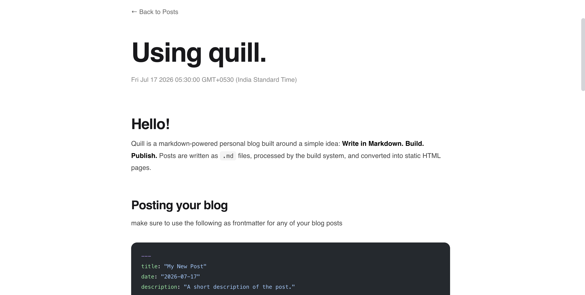

# quill
a minimal markdown powered personal blog and static site generator built with HTML, CSS, and JavaScript.


## description
quill is a lightweight blogging system designed around a simple workflow:

> Write in Markdown → Build → Publish

instead of relying on large frameworks, quill converts markdown files into static HTML pages that can be hosted anywhere, including github pages. it is designed to integrate seamlessly with markdown file editors such as obsidian, allowing you to write notes locally and publish them as a clean, searchable website. this site was primary built to work in hand with obsidian by linking folders from your vault to the posts directory in this project. 

## features
- markdown based writing
- static html generator
- automatic post listing
- tags support
- search function
- syntax highlighting
- obsidian friendly workflow

## installation
1. clone the repository
```
git clone https://github.com/imunknown7/quill.git
cd quill
```

2. install dependencies
```
npm install
```

3. build the site
```
npm run build
```

4. edit your posts and host to github pages or any hosting service to view your quill blog page.


## writing your posts
open the `posts/` directory and add your posts as markdown file. anytime you edit posts or create new posts you have to run `npm run build` and then go into the hosting process.

## syncing your obsidian posts

rather than using symbolic links, keep your obsidian vault as the source of truth and mirror the contents into quill's `posts` directory before publishing.

### macOS / Linux

```bash
rsync -av --delete /path/to/ObsidianVault/posts/ /path/to/quill/posts/
```

### Windows

```cmd
robocopy "C:\path\to\ObsidianVault\posts" "C:\path\to\quill\posts" /MIR
```

both commands keep the `posts` directory inside quill synchronized with your obsidian vault:

* new files are copied.
* existing files are updated.
* deleted files are removed from the destination.

---

## automating the workflow

instead of manually syncing, building, and pushing every time, you can automate the entire publishing process.

create a `publish.sh` script (or a `.bat`/PowerShell equivalent on Windows) in the root of your Quill project.

```bash
#!/bin/bash

set -e

echo "Syncing posts..."
rsync -av --delete "/path/to/ObsidianVault/posts/" "./posts/"

echo "Building..."
node js/build.js

echo "Committing..."
git add .
git commit -m "Update writings" || true

echo "Pushing..."
git push

echo "Done."
```

after making the script executable:

```bash
chmod +x publish.sh
```

publishing your blog becomes as simple as:

```bash
./publish.sh
```

the script will:

1. synchronize your obsidian posts with quill.
2. rebuild the site.
3. stage all changes.
4. commit them.
5. push everything to GitHub.

this keeps your obsidian vault as your writing workspace while quill remains the publishable version of your blog.


## screenshots




---
<div align="right">- made by dynamo</div>